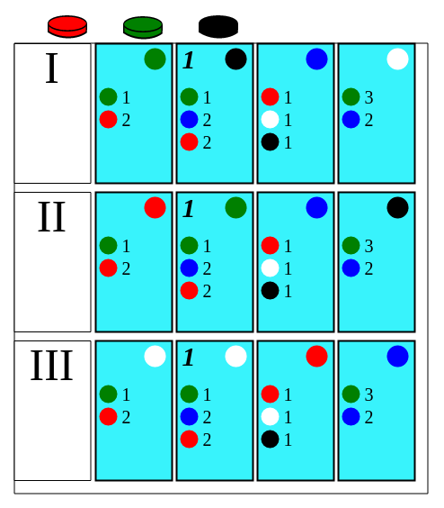

Let's see if I can get splendor working

Screenshot as of 01/06/2015



## Installation

```shell
git clone https://github.com/afiodorov/splendor.git
cd splendor
npm install
./after-npm-install.sh
```

## Running

```shell
gulp
```

Go to [http://localhost:5000/](http://localhost:5000/) to see it
